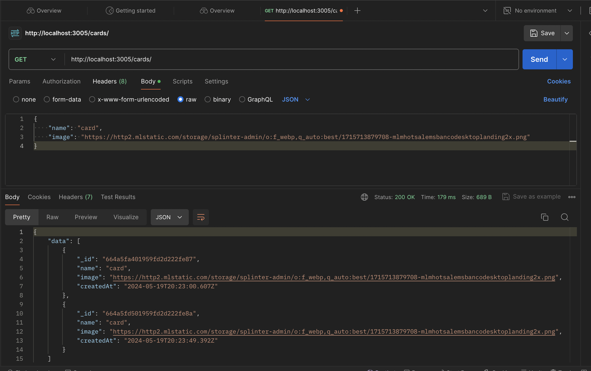
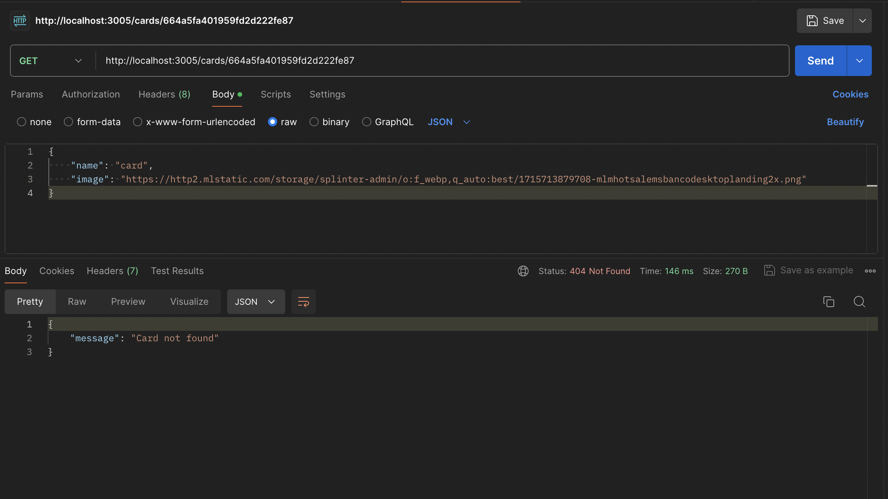
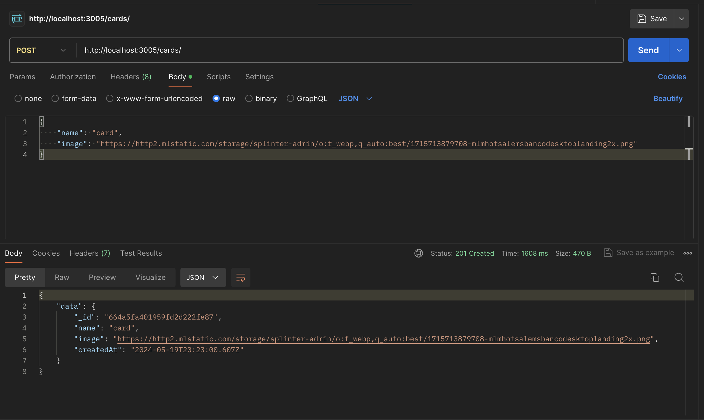

# Tripleten Test Assignment

## React App

<strong>1. Do the components render correctly? If not, what's wrong in the code?</strong>

Your components render correctly but
1. When I reproduced the project I faced a problem with babel-jest. If you found it challenging consider reinstall dependencies and delete node_modules and package.lock.json or testing in another project or editor online.

2. It happened some problems with jwt, I tested it on Postman and then I copied the jwt in the browser and I can signin finally, then I can test the rest of the functionality and the Private route, everything is working correctly. Read the question 4 and check the repo to know how to fix the error in the code.
Your logout function works, your signup and signup fix it, see the code in the repo to give you an example:

[text](https://github.com/CesarAdan1/config/blob/main/README.md)

* Enhance the Tooltip logic to display success/failure notifications for signin and signup actions.
* Validate user actions, like confirmation prompts before deleting items, for improved UX.

Comments:
* To test in Postman, you can use this credentials:
{
  "email": "testuser@example.com",
  "password": "TestPassword123"
}, in signup: https://register.nomoreparties.co/signup and then in signin: 
https://register.nomoreparties.co/signin, it will generate the token.
* Copy it! and then go to the app, open dev tools and go to the Application tab, search for localStorage in Storage on the right side menu, then in the value field where the key indicates jwt, paste the jwt that was generate it in postman when login. Just to test other features in your app.

Good approaches:
You build a responsive site. 
When you singin again, the changes you make such as: username, title, cards, likes words correctly and shows any update you made it before logout.

Your EditProfilePopup, AddPlacePopup, EditAvatarPopup, ImagePopup components works perfectly.

Your profile images, your info can be edit it, also you can add other cards and continue working when you re-signin.

<strong>2. Is it possible to simplify the project infrastructure? How would you recommend reorganizing it?</strong>

To simplify I recommend you to use some configurations that are use in large projects in some companies using the react app configuration without any tool such as create-react-app. Check the repo below: 

[text](https://github.com/CesarAdan1/config/blob/main/README.md)

This could be useful in your job projects.

Alternatively, you can use vite: 
1. Instal globally: npm install -g create-vite
2. Create the project:
npm create vite@latest, follow the instructions to create the app.

Or you can use preact, a lightweight version: 
create-vite preact my-preact-app

<strong>3. Are all routes configured correctly (including protected routes)?</strong>
Your routes are configured corrected. When you go to the private route, you cant access without any authentication process and you are redirected to login.
Public routes: `/signin` and `signup` works perfectly.

<strong>4. Are the necessary manipulations with the JWT implemented correctly in App.js?</strong>

JWT methods are implemented, but some issues persist. For testing, consider the following: 

To test in Postman, you can use this credentials:
```json
{
  "email": "testuser@example.com",
  "password": "TestPassword123"
}
```
in `/signup`: https://register.nomoreparties.co/signup and then in `/signin`: 
https://register.nomoreparties.co/signin, it will generate the token.


Copy it! and then go to the app, open dev tools and go to the Application tab, search for localStorage in Storage on the right side menu, then in the value field where the key indicates jwt, paste the jwt that was generate it in postman when login. Just to test other features in your app.

Signout method works, it removes the token and take you to /signin.

Try to fix your auth methods. Could be useful
https://github.com/CesarAdan1/config/blob/main/README.md)

## Node App

<strong>1. Do all requests get the correct responses?</strong>

After I solved the issues in the API and configure the project with a MongoDB url I checked it in MongoDB compass and Postman.
I have tha responses:

So, GET and POST and DELETE requests are working as expected and also the validation you added to the mongoose Model is working and mark the validation in Postman when I checked it and write a number in the name where is necessary to be a string.

Your responses
### http://localhost:3005/cards


### http://localhost:3005/cards/:id


### http://localhost:3005/cards


### http://localhost:3005/cards/:id


Comments: 
Consider use your browser check the GET requests, and to simulate consider use postman. 

Consider instal a JSON format extension in your browser.
In the DELETE controller you can consider to use deleteOne.

Consider to change the routes file to:
const router = require('express').Router();

```javascript
const {
  createCard,
  getCards,
  getCard,
  deleteCard,
} = require('../controllers/cards');

router.get('/', getCards);
router.get('/:id', getCard);
router.post('/', createCard);
router.delete('/:id', deleteCard);

router.use((err, req, res, next) => {
  console.error('Error en la ruta:', err);
  res.status(500).send({ message: 'Error en el servidor' });
});

module.exports = router;
```
You can use a MongoDB Atlas in the free tier. You can check this: 

<strong>2. Do these requests correspond to REST API principles?</strong>

Yes, The principles you are using them correctly.

1.Statelessness:(e.g. req.body for POSt and req.params.id for GET and DELETE methods)
2.Client-Server separation: logic in the server and client are separated.
3.Uniform Interface: Your API uses standards in your HTTP methods to perform operations:  
GET /: Retrieve all cards.
GET /:id: Retrieve a single card by ID.
POST /: Create a new card.
DELETE /:id: Delete a card by ID

You can add cacheability to fulfill the REST principles. But you covered the principles in general to build a good API REST.

<strong>3. Is the incoming data correctly validated? The Validator.js library is used for validation. What can be removed or changed in validation if reviewers only require the URL validation for the image link?</strong>

If reviewers only want to validate the image url, you can remove in the name field in the mongoose model like this: 
```javascript
name: {
    type: String,
    required: [true, 'The name field must be filled'],
    minlength: [2, 'Min length is 2'],
    maxlength: [30, 'Max length is 30']
    // the letters only validation has been removed (isAlpha)
  }
```
When you create a POST request to create a Card. Add this body in postman:
```json
{
  "name": "Hello",
  "image": "https://example.com/image.png"
}
```
to check the validation in the url, try to add a text like this:

```json
{
  "name": "ValidName",
  "image": "invalid-url"
}
```
You will see the error message:
```json
{
  "message": "Must be a valid URL"
}
```
<strong>4. Is it possible to add or remove unintended data to database?</strong>

No, is not possible as you add the validations correctly, you create the controllers and routes secur, so requests and errors can manage properly.

Is difficult to see the possiblity to manipulate data intentionally as you use a correct configuration to avoid it.

## HTML & CSS

<strong>1. Is this markup semantically correct? Are there tags that are used incorrectly?</strong>

You use well the semantic HTMl, you use: 
- <header> tag for the header.
- <section> for every section part of the page.
- Main content is correctly use with <main> tag
- Footer information in <footer> is correct.
- You use a <form> for signin and singup. It is a good approach.

However you use lots of divs, for better semantic, consider use: 
<article>, <nav>, <ul> and <li>

Consider this div line:  
```html
 20  <div class="menu">
 with a <nav> for better semantic.

 Consider to use <button> with interactive elements, would be great for semantics and accessibility. Here:
<span class="button header__button">Search</span>

48 " alt="no">, consider a better informative alt text. For example: "Search"

In this lines: 
 <a href="#" class="card">
        <div class="card__body">

Consider a better representation for semantics:
 <a href="#" class="card">
<article class="card">
  <div class="card__body">

For modals of signin and signup consider to envolve every <section></section>. E.g.
<dialog id="modal">
    <section>...</section>
</dialog>
```
<strong>2. Are there mistakes in the names, in the usage of the blocks, elements, and modifiers?</strong>

Lets go block by block:

- Header
```html
<header class="header">
  <div class="menu">
    <a href="./" class="menu__logo">Explorer</a>
    <div class="menu__item menu__item--mobile" id="mobile-menu"></div>
    <div class="menu__items-list">
      <a href="./" class="menu__link menu__link--selected">Home</a>
      <div class="menu__item">
        <span class="menu__link menu__link--logged">User
          <span class="menu__logout"></span>
        </span>
      </div>
    </div>
  </div>
  <div class="header__title-wrapper">
    <h1 class="header__title">What's going on in the world?</h1>
    <p class="header__subtitle">
      <b>Find the latest news on any topic and save them in your personal account.</b>
    </p>
    <div class="header__form">
      <input class="header__form-input" type="text" name="search" placeholder="Enter the topic" required/>
      <span class="header__button button">Search</span>
    </div>
  </div>
</header>
```
The correction explanation:
* Changed menu__items-single-item to menu__item to properly denote a single item in the menu.
* Changed menu__mobile to menu__item menu__item--mobile to follow BEM conventions for modifiers.
Changed menu__link_logged to menu__link menu__link--logged to correctly apply the modifier.
Changed menu__link_selected to menu__link menu__link--selected for consistency in the modifier usage.
* Changed button header__button to header__button button to ensure header__button is clearly part of the header block and follows BEM's rule of element first, then modifier.

- Preloader
```html
<section class="preloader">
  <div class="preloader__message" id="preloader-searching">
    <i class="preloader__circle"></i>
    <h5 class="preloader__subtitle">Searching...</h5>
  </div>
  <div class="preloader__message preloader__message--hide" id="preloader-not-found">
    " alt="no">
    <h4 class="preloader__title">Nothing was found</h4>
    <h5 class="preloader__subtitle">Nothing was found on your request</h5>
  </div>
</section>
```
Corrections:
* Changed preloader__hide to preloader__message--hide to correctly apply the modifier to the element preloader__message using BEM conventions.
* Changed circle-preloader to preloader__circle to keep the naming consistent with the preloader block and follow BEM methodology.

- Card container
```html
<main class="results">
  <h3 class="results__title">Search Results</h3>
  <div class="results__news">
    <a href="#" class="card">
      <div class="card__body">
        <div class="card__image-wrapper">
          <div class="card__img"></div>
        </div>
        <div class="card__icon"></div>
        <p class="card__warning">Log in to save articles</p>
        <div class="card__wrapper">
          <p class="card__date">August 2, 2021</p>
          <h4 class="card__title">Why do we use it?</h4>
          <div class="card__text">...
          </div>
        </div>
      </div>
      <p class="card__src">lipsum.com</p>
    </a>
    <a href="#" class="card">
      <div class="card__body">
        <div class="card__image-wrapper">
          <div class="card__img"></div>
        </div>
        <div class="card__icon"></div>
        <p class="card__warning">Log in to save articles</p>
        <div class="card__wrapper">
          <p class="card__date">August 2, 2021</p>
          <h4 class="card__title">Why do we use it?</h4>
          <div class="card__text">It is a long established 
            ...
          </div>
        </div>
      </div>
      <p class="card__src">lipsum.com</p>
    </a>
    <a href="#" class="card">
      <div class="card__body">
        <div class="card__image-wrapper">
          <div class="card__img"></div>
        </div>
        <div class="card__icon"></div>
        <p class="card__warning">Log in to save articles</p>
        <div class="card__wrapper">
          <p class="card__date">August 2, 2021</p>
          <h4 class="card__title">Why do we use it?</h4>
          <div class="card__text">
            ...
          </div>
        </div>
      </div>
      <p class="card__src">lipsum.com</p>
    </a>
    <a href="#" class="card">
      <div class="card__body">
        <div class="card__image-wrapper">
          <div class="card__img"></div>
        </div>
        <div class="card__icon card__icon--marked"></div>
        <p class="card__warning">Log in to save articles</p>
        <div class="card__wrapper">
          <p class="card__date">August 2, 2021</p>
          <h4 class="card__title">Why do we use it?</h4>
          <div class="card__text">
            ...
          </div>
        </div>
      </div>
      <p class="card__src">lipsum.com</p>
    </a>
  </div>
  <button class="button results__button">Show more</button>
</main>
```
Corrections:

* Changed Class Names:

card_image-wrapper to card__image-wrapper
card_img to card__img
card_wrapper to card__wrapper
card_date to card__date
card_title to card__title
card_text to card__text
card_src to card__src

* Modifier:
card__icon_marked to card__icon--marked

- About
```html
<section class="about">
  <div>
    <h3 class="about__title">About author</h3>
    <p class="about__text">
      Vivamus sed volutpat odio. Praesent placerat gravida erat, in ornare ex. <br/> Nullam vitae tellus euismod, egestas
      <br/> In ultricies dolor quis neque pellentesque pharetra.
    </p>
    <p class="about__text">
      Quisque urna magna, molestie id nisl vitae, bibendum auctor sem. <br/> Aliquam efficitur orci elit, lacinia fringilla
    </p>
  </div>
</section>
```
Corrections explanation:

* The results__about class was removed because about is a separate block and should not be an element of results.

- Footer
```html
<footer class="footer">
  <p class="footer__legal">© 2021</p>
  <ul class="footer__menu">
    <li class="footer__menu-item"><a href="./">Home</a></li>
    <li class="footer__menu-item"><a href="./about/">About</a></li>
    <li class="footer__menu-item"><a href="https://practicum.yandex.com" target="_blank">Practicum by Yandex</a></li>
  </ul>
  <div class="footer__social-links">
    <a href="#" class="footer__social-icon" target="_blank">
      " alt="GitHub Logo">
    </a>
    <a href="#" class="footer__social-icon" target="_blank">
      " alt="Facebook Logo">
    </a>
  </div>
</footer>
```
Corrections:
* The footer__links class was renamed to footer__social-links to clarify that it contains social icons, making the intent clearer.
* The footer__social-icon elements are a correctly part of footer__social-links as they should logically be a collection of social links.

- Forms

Correction Element structure:

Check auth-form__error-message and other elements are nested correctly within auth-form. You added in incorrect order.

<strong>3. Are there mistakes in the BEM file structure? Explain in detail.</strong>

The BEM(Block, Element, Modifier) is well implemented I can detect some inconsistencies. For example:
```html
<div class="menu__items-single-item">
    <span class="menu__link menu__link_logged">User
      <span class="menu__logout"></span>
    </span>
</div>
```

here you can simplify: -single-item to menu__item

For more consistent BEM naming and also removed redundant and inconsistent classes.

<strong>4. Analyze the adaptive design and comment on the decisions that were made in this code.</strong>

I checked your code in all the browsers I have(Firefox, Safari, Brave, Duckduck go and Chrome), generally is ok, but in mobile friendly I have some comments. We go deeply by sections.

- Header
    The header is well-adaptive, it shows a hamburger menu when is mobile and tablets less than 76px.
    The hamburger menu is well implemented, it shows the menu when is clicked and also it is hidden when is clicked again.

- Content inside the image.
    Text: Generally works fine. And in the css is ok.
    referring to the Enter topic input and the search button, it has an asymetric size and also they are not well-centered in the container.
- In the responsive modal you can consider to 
To fix this, you can consider this:

The searching loading with text is perfectly adaptive in any screen and the svg is showing in any browser I teste it.

In the search results section, I have some comments.

1. In mobile the elements display well, but in desktop and table sizes is not the case. 
You must consider to use an ellypsis style as the text description is very large,consider a show more button when click show a modal with the full content or just show the complete text. 
Is a better approach to set the save button in other part as it cover the title text, for example in the right button corner of the image.
Respect to the title we can improve that in desktop version, by resizing the letters with em or by adding a wider and heigher spaces in the title. 

The image in mobile and tablets devices does not show the complete image, consider in css: cover: fit property.

Consider this: 

[text](https://github.com/CesarAdan1/config/blob/main/README.md)

The show more button is perfectly center.
The about the autor. May you consider add a little bit more space in the margin-right: 5px in mobile.

And the footer section is well-adaptive.

Tips: 
<strong>For UX we can use in the input search:
autocapitalize="off", autocomplete="off",
autocorrect="off", spellcheck="false". This is specially useful in
system design interviews in this way you can, make the browser
suggestions dont interfere with the user's search
<strong>